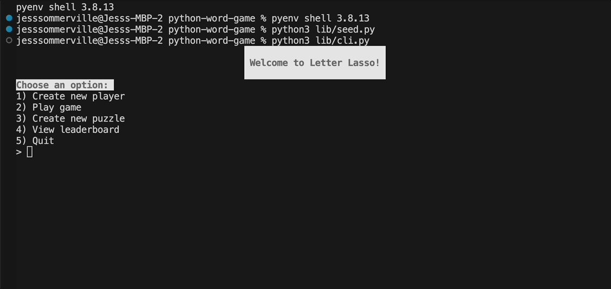

# Letter Lasso 🐎 🤠

Welcome to Letter Lasso, a [Wordle](https://www.nytimes.com/games/wordle/index.html)-like CLI built with Python and SQLite. Choose from a selection of puzzles, then wrangle your letters together in 6 guesses or less to find the solution. View your scores (and your competition) in the leaderboard.

***

## Installation

1. Fork and clone this repo from Github to your local environment
2. Navigate into your local directory and open the contents in your preferred code editor
3. Run `pipenv install` to install dependencies 
4. Run `pipenv shell` to create virtual environment
5. From the project directory, run `python3 lib/seed.py` to populate the database with puzzles

## Use 
Ready to play? Here's how to get started: 
1. Run `python3 lib/cli.py`
2. Enter a number 1-4 from the menu. Start with 1 to register as a new player. 
3. Follow the resulting prompts
4. Type "5", "exit", or "quit" at any point to end the program

## Features 
 

🐎 Create a new player  
🐎 Select an unplayed puzzle  
🐎 Take up to 6 guesses per puzzle  
🐎 Receive your score  
🐎 Create a new puzzle  
🐎 View high scores by puzzle  

## Data tables
🤠 players  
- Stores players with their **username**
- Maps to the Python class Player 

🤠 puzzles  
- Stores puzzles with their **solution**
- Maps to the Python class Puzzle
- Puzzle class includes methods for `get_scores()` and `high_scores()` to access all scores and best scores for each puzzle 

🤠 results  
- Stores results with their **player_id, puzzle_id, score,** and **number of guesses**
- Maps to the Python class Result

Methods available for all Python classes include: `create`, `save`, `update`, `delete`, `get_all`. 

## Contributor blogs
- [Meridith](https://medium.com/@meridithlawn2)
- [Drew](https://dev.to/drwomble)
- [Jess](https://medium.com/@jesscsommer)

## References 
[Python Wordle Clone](https://realpython.com/python-wordle-clone/)

## License
[MIT](https://choosealicense.com/licenses/mit/)
